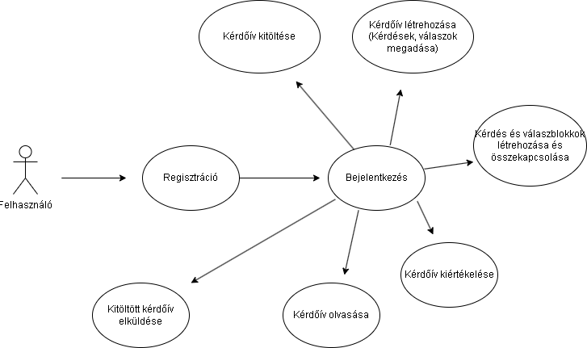
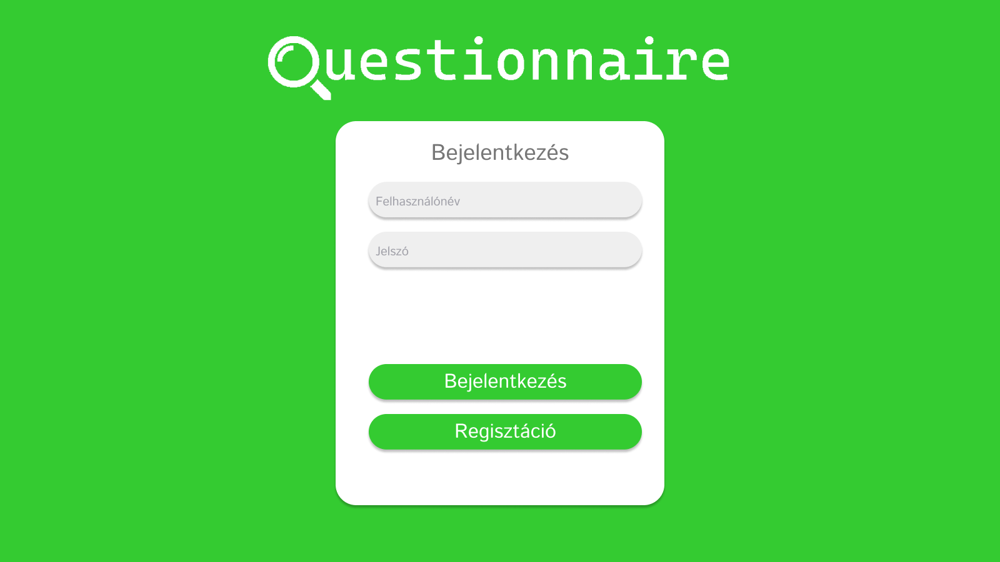
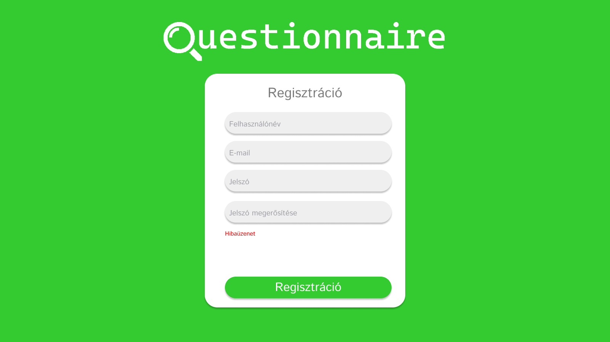
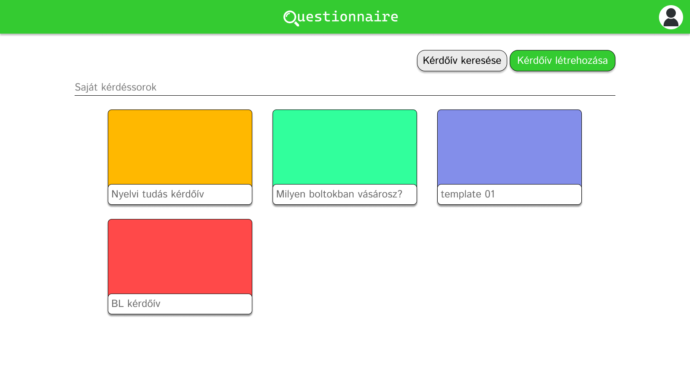
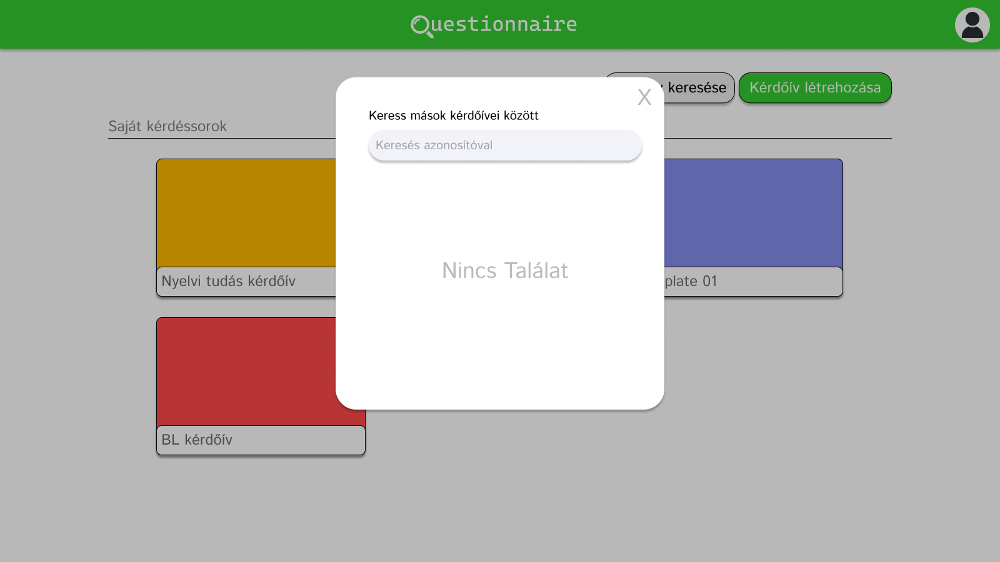
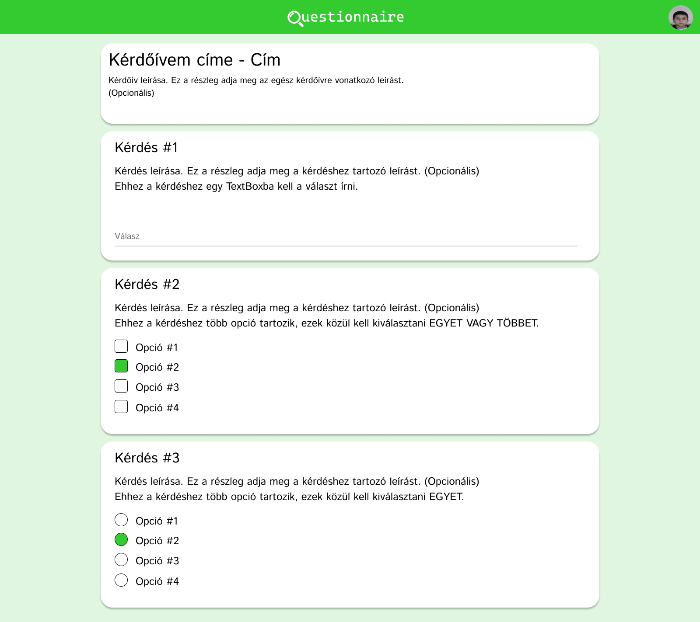

# Questionnaire - Funkcionális specifikáció

## 1. Áttekintés:
A Questionnaire célja egy modern, digitális megoldás 
létrehozása a kérdőívek kezelésére és kiértékelésére. A 
jelenlegi papíralapú kérdőívek manuális feldolgozása és 
kiértékelése jelentős időt és erőforrást emészt fel, ami a 
mai felgyorsult üzleti környezetben elfogadhatatlan. A 
megrendelő ráébredt, hogy a digitális átállás elengedhetetlen 
a hatékony működés érdekében.

Legfőbb céljaink:

- Könnyen kezelhető felhasználói felület biztosítása
- Különböző típusú és témájú kérdőívek létrehozása és 
kitöltése
- Automatizált eredmény kiértékelés és elemzés.
- Reszponzív dizájn, hogy a felhasználók kényelmesen 
használhassák számítógépen és okostelefonon egyaránt.
- Lehetőség a felhasználók számára tippek és jóslatok adására 
és fogadására.

 Jelenleg több rendszer is létezik erre a célra, a 
 legismertebb talán a Google Forms, ahol saját részre tudunk 
 kérdőíveket készíteni, megosztani, ellenőrizni, azonban itt 
 a tervező felhasználó lehetőségei igen szűkösek, 
 korlátozottak és a kitöltéséhez Gmail fiókra van szükség.
 Mi szeretnénk egy kicsit mást csinálni, a mi applikációnk  
 sokrétűen felhasználható, például oktatási területen is, 
 ahol lehetőség van a diákok fejlődésének és teljesítményének 
 nyomon követésére. Az adatokat az alkalmazás egy 
 adatbázisban fogja tárolni, hogy később is könnyen     
 elérhetőek legyenek. Megfelelve a mai kor követelményeinek, 
 a program számítógépen és okostelefonon is megfelelő módon 
 kell működjön. Ezen kívül a programnak képesnek kell lennie 
 a felhasználóktól tippeket/ jóslatokat kérni és fogadni, 
 például "Ki fogja megnyerni a következő teniszmeccset?"

## 2. Jelenlegi helyzet:
A megrendelő jelenleg egy hagyományos papíralapú kérdőívet alkalmaz, ami már nem hatékony a felgyorsult világban. 
Ez kézi rendezést és kiértékelést igényel, ami jelentős időt és munkát emészt fel, akár 10-15 percet is képes elvenni egy-egy kérdőív
esetén. 
Ebben a modern korszakban egyetlen vállalat sem engedhet meg magának ilyen időveszteséget, és a megrendelő is rájött erre.
Ez a modell több okból is problémás és nem fenntartható hosszú távon,
előnye nincs sok, de hátránya annál több. 
Itt az ideje hogy egy digitális megoldással kiváltsuk ezt az elavult
kérdőívezési módszert. 
Ma már a legtöbb folyamat online zajlik, az irodákban nem papír, hanem digitális eszközök és számítógépek dominálnak.
Ennek következtében a megrendelő úgy döntött, hogy lép egyet előre a digitalizáció útján, és olyan rendszert szeretne, amely lehetővé teszi könnyedén felmérni különböző témákban emberek tudását. 
Ezt automatikus eredménykiértékeléssel és reszponzív designnal kívánják megvalósítani.
Jelenleg több megoldás is létezik a kérdőív készítésre. 
A talán legismertebb közülük a Google Forms, ahol létrehozhatunk, megoszthatunk és ellenőrizhetünk saját kérdőíveket. 
Viszont itt a tervezési lehetőségek meglehetősen szűkösek és korlátozottak, emellett a kitöltéshez Gmail fiókra van szükség.
A mi fejlesztésünk a Questionnaire nevet viseli, és célja egy felhasználóbarát, dinamikus webes kérdőívkezelő program készítése.
Ez lehetővé teszi a felhasználók számára különböző típusú és témájú kérdőívek létrehozását, kitöltését és az eredmények elemzését. 
A program célja, hogy különböző területeken (például oktatás, piackutatás, felmérések) dolgozó személyek is könnyedén használhassák. 
Az oktatásban különösen hasznos lehet, mivel segítségével a diákok tanulása és fejlődése egy magasabb szintre emelkedhet, 
így a tanórák is érdekesebbé válnak. 
Mindenki a saját okoseszközén tudja kitölteni a kérdőíveket.
A programnak meg kell felelnie a mai kor elvárásainak, és tökéletesen kell működnie számítógépen és okostelefonon egyaránt. 
Emellett lehetőséget kell biztosítania a felhasználók számára, hogy tippeket és jóslatokat tegyenek, például 
"Ki fogja megnyerni a következő futball világbajnokságot?"
A kérdőívek kitöltése során a cél az információk gyűjtése, melyeket egy adatbázisban fogunk tárolni a későbbi felhasználás céljából.

## 3. Követelménylista

| Modul       | ID  | Név                                     | Leírás                                                                                                                                                                                                                                                                                                                           |
| ----------- | --- | --------------------------------------- | -------------------------------------------------------------------------------------------------------------------------------------------------------------------------------------------------------------------------------------------------------------------------------------------------------------------------------- |
| Megjelenés  | K1  | Reszponzivitás                          | Az oldal megjelenésének reszponzívnak kell lennie. Illeszkedjen hiba nélkül mobil illetve számítógépes felületen.                                                                                                                                                                                                                  |
| Jogosultság | K2  | Regisztáció                             | A felhasználónak a regisztrációhoz meg kell adnia egy felhasználónevet, egy emailt, illetve kétszer a jelszót (ellenörzés képpen). A jelszó titkosítani kell, mielőtt a frontend átküldené a backendre. Ha a felhasználónév vagy az email már foglalt, vagy a jelszó nem felel meg az előírt regexnek, akkor az oldal hibát dob. |
| Jogosultság | K3  | Bejelentkezés                           | A felhasználó az emailcím, illetve a jelszó megadásával tud az oldalra bejelentkezni. Hibás adat megadása esetén az oldal hibát dob.                                                                                                                                                                                             |
| Jogosultság | K4  | Felhasználó jogosultságai               | Mások kvízeinek kitöltése. Saját kvíz létrehozása, szerkesztése, illetve törlése                                                                                                                                                                                                                                                 |
| Módosítás   | K5  | Felhasználói adatok módosítása          | A felhasználó módosítani tudja a saját adatait. Az adatok módosításának érvényesítéséhez a felhasználónak meg kell adnia a jelszavát                                                                                                                                                                                             |
| Módosítás   | K6  | Jelszó módosítása                       | A felhasználó módosítani tudja a jelszavát. Ehhez meg kell adnia a régi jelszavát, illetve az újat kétszer. Itt is az új jelszót titkosítani kell, mielőtt a frontend átküldi a backendnek, illetve meg kell felelnie az előírt regexnek.                                                                                        |
| Feladat     | K7  | Feladat kitöltése                       | A felhasználó mások által elkészített kérdéssorozatokat tud kitölteni.                                                                                                                                                                                                                                                           |
| Feladat     | K8  | Pontok megtekintése                     | A feladat kitöltését követően a felhasználó meg tudja nézni az elért pontokat, illetve hogy melyik kérdést válaszolta meg helyesen, illetve helytelenül                                                                                                                                                                          |
| Feladat     | K9  | Feladat létrehozása                     | A felhasználók saját kérdéssorozatokt tudnak létrehozni, illetve ezeket meg tudják osztani más felhasználókkal.                                                                                                                                                                                                                  |
| Módosítás   | K10 | Feladatok módosítása                    | A felhasználók a saját kvízeiket tudják szerkeszteni.                                                                                                                                                                                                                                                                            |
| Módosítás   | K11 | Feladatok törlése                       | A felhasználók a saját kvízeiket tudják törölni.                                                                                                                                                                                                                                                                                 |
| Felület     | K12 | Bejelentkezés                           | Ezen a felületen lehet bejelentkezni.                                                                                                                                                                                                                                                                                            |
| Felület     | K13 | Főoldal                                 | Bejelentkezést követően a felületen megjelenik a felhasználó által készített kvízek, illetve egy ikon, amelyre kattintva a felhasználó meg tudja tekinteni az adatait                                                                                                                                                            |
| Felület     | K14 | Adatok megtekintése                     | A felhasználók itt tudják megtekinteni a saját adataikat, illetve ezen a felületen tudják módosítani azokat.                                                                                                                                                                                                                     |
| Felület     | K15 | Kérdéssorozat kitöltése                 | Ezen a felületen jelennek meg a kérdések.                                                                                                                                                                                                                                                                                        |
| Felület     | K16 | Kérdéssorozat értékelése                | Ezen a felületen jelenik meg a kérdésekre adott válaszok statisztikája.                                                                                                                                                                                                                                                          |
| Felület     | K17 | Kérdéssorozat létrehozása, szerkesztése | Ezen a felületen lehet szerkeszteni az adott kvízt.                                                                                                                                                                                                                                                                              |

## 4. Jelenlegi üzleti folyamatok modellje:

### Igényelt üzleti folyamatok modellje
A megrendelő szeretne egy olyan online felületet, ahol egy felhasznaló a regisztráció, majd a  bejelentkezés után (azonosító és jelszó megadása után) kérdőívet tölthet ki. Amennyiben szeretné, saját maga is tud létrehozni kérdőívet, egyedi blokkokkal és kérdésekkel vagy válaszokkal. Minden felhasználó hozzáfér a többi felhasználó kérdőíveihez is.

## 6. Használati esetek
1. Felhasználói regisztráció
    - Leírás:  A felhasználó regisztrálja magát az alkalmazásban, hogy hozzáférhessen a rendszerhez.
    - Főbb lépések:
        1. A felhasználó kiválasztja a "Regisztráció" lehetőséget a kezdőoldalon.
        2. Megadja a szükséges regisztrációs információkat (felhasználónév, e-mail cím, jelszó).
        3. Elküldi a regisztrációs adatokat a rendszernek.
        4. A rendszer ellenőrzi az adatokat és regisztrálja a felhasználót.
2. Felhasználói bejelentkezés
    - Leírás: A felhasználó bejelentkezik az alkalmazásba, hogy hozzáférhessen a funkcionalitásokhoz.
    - Főbb lépések:
        1. A felhasználó kiválasztja a "Bejelentkezés" lehetőséget a kezdőoldalon.
        2. Megadja a regisztrált e-mail címét és jelszavát.
        3. Elküldi a bejelentkezési adatokat a rendszernek.
        4. A rendszer ellenőrzi az adatokat és bejelentkezteti a felhasználót.
3. Kérdőív kitöltése
    - Leírás: A felhasználó kitölt egy meglévő kérdőívet. A kérdőívet egy adott azonosítóval, vagy egy linken keresztül éri el.
    - Főbb lépések:
        1. A felhasználó kiválasztja a "Kérdőív keresése" opciót a főmenüben, majd rákeres a kérdőív azonosítójára, vagy egy adott linken keresztül megnyitja a kérdőívet.
        2. Válaszol a kérdésekre.
        3. Elküldi a válaszait.
4. Kérdőív statisztikájának megtekintése
    - Leírás: Felhasználó megtekintheti egy saját kérdőív statisztikáit.
    - Főbb lépések:
        1. A felhasználó kiválasztja a kívánt kérdőívet a kérdőív listából.
        2. A rendszernek meg kell jelenítenie a kérdőív kitöltéseinek összesített statisztikáit, például válaszok gyakoriságát, átlagos válaszokat és egyéb releváns statisztikai adatokat.

4. Kérdőív létrehozása
    - Leírás: A felhasználó létrehoz egy új kérdőívet a nevének és a kérdéseknek a megadásával.
    - Főbb lépések:
        1. A felhasználó a felületen kiválasztja az "Új kérdőív létrehozása" opciót.
        2. Megadja a kérdőív nevét. Opcionálisan a leírását.
        3. Hozzáad kérdéseket a kérdőívhez.
        4. Beküldi a kérdőívet.
        5. Sikeres létrehozás esetén a rendszer visszaigazolja a kérdőív létrejöttét és egyedi azonosítót generál hozzá.
## 7. Képernyő tervek

A projekt tervezése során a számítógépes megjelenítés mellett a telefonos megjelenítést is preferáljuk, és ebben a kontextusban néhány tervezési elvet alkalmaztunk. A grafikus felhasználói felület (GUI) letisztult és könnyen kezelhető lesz, hogy a felhasználók könnyedén és hatékonyan használhassák az alkalmazást.

A letisztult és könnyen kezelhető GUI több előnnyel jár:

- Felhasználóbarát: Az egyszerű és intuitív tervezés segíti a felhasználókat a könnyű használatban, minimalizálva az esetleges frusztrációt vagy félreértéseket.
- Gyors tanulási idő: A letisztult tervezés minimalizálja a tanulási időt, így a diákok gyorsan megtanulhatják az alkalmazás működését.
- Hatékony információáramlás: Az egyszerűsített felület segíti a hatékony információátadást és tanulást, mivel a felhasználók kevesebb időt töltenek el a navigációval és a feladatok elvégzésével.
- Professzionális megjelenés: A letisztult design professzionális megjelenést kölcsönöz az alkalmazásnak, ami növeli az elfogadottságot és a használhatóságot.

Az alábbiakban pár képernyőtervet szemléltetünk.

A Login/Bejelentkezés felülete:

A regisztráció felülete:

A belépést követően a felhasználó a Home pagen találja magát.

A Home Page felülete:

Egy kérdőív eléréséhez használhatunk egy linket, vagy a kérdőívhez tartozó azonosítót. Az azonosító beírásához a Home Pagen található Kérdőív keresése gombra kell kattintani ekkor a következő ablak ugrik fel:

A kereső doboz terve:

A megnyitott kérdőív a következőképpen rendeződik el:

A Kérdőív felülete:

## 8. Forgatókönyv

#### 1. Forgatókönyv a felhasználói regisztrációhoz:
1. A felhasználó a főoldalon választja a "Regisztráció" lehetőséget.
2. A felhasználónak meg kell adnia a kötelező adatokat: felhasználónév, e-mail cím, jelszó.
3. A rendszer ellenőrzi az adatok helyességét és az emailcím egyediségét.
4. Ha az adatok megfelelőek, a rendszer regisztrálja a felhasználót és átirányítja a felhasználót a belépési oldalra, ha nem hibaüzenetet dob.

#### 2. Forgatókönyv a felhasználói bejelentkezéshez:
1. A felhasználó a főoldalon választja a "Bejelentkezés" lehetőséget.
2. A felhasználónak meg kell adnia a regisztrált e-mail címét és jelszavát.
3. A rendszer ellenőrzi az adatok helyességét.
4. Ha az adatok megfelelőek, a rendszer belépteti a felhasználót és átirányítja a felhasználót a főoldalra. Nem megfelelő adat esetén a rendszer hibaüzenetet ad.

#### 3. Forgatókönyv meglévő kérdőív kitöltéséhez:
1. A felhasználó belép a rendszerbe, és megad egy kérdőív azonosítót, vagy linken keresztül megnyitja a kitölteni kívánt kérdőívet.
2. A felhasználó kitölti a kérdéseket és megadja a válaszokat.
3. A felhasználó elküldi a kitöltött kérdőívet.

#### 4. Forgatókönyv új kérdőív létrehozásához:
1. A felhasználó belép a rendszerbe és választja a "Kérdőív Létrehozása" lehetőséget.
2. A felhasználó megadja a kérdőív címét és opcionálisan a leírását.
3. A felhasználó hozzáad kérdéseket, válaszlehetőségeket és beállítja a kérdőív tulajdonságait.
4. A felhasználó elkészíti a kérdőívet és elmenti.

#### 5. Forgatókönyv meglévő kérdőív törléséhez:
1. A felhasználó belép a rendszerbe és kiválasztja a már létező kérdőívek közül azt, amelyet törölni szeretne.
2. A felhasználót egy ablak fogadja, amellyel megerősíti a törlési szándékát.

#### 6. Forgatókönyv saját kérdőív statisztikáinak megtekintéséhez:
1. A felhasználó belép a rendszerbe és választja a "Saját Kérdőívjeim" lehetőséget a menüből.
2. A felhasználó kiválasztja a megtekinteni kívánt kérdőívet a listából.
3. A felhasználó kattint a "Statisztikák" vagy hasonló gombra a kiválasztott kérdőívhez tartozó sorban.
4. A rendszer betölti a kérdőív statisztikáit, például kitöltések száma, válaszok eloszlása stb.
5. A felhasználó megtekinti és elemezi a statisztikákat a kérdőív teljesítményének felmérése céljából.

## Fogalomszótár
### Google Forms: 
A Google Forms egy felmérés-adminisztrációs szoftver, amely a Google által kínált ingyenes, webalapú Google Docs Editors programcsomag része. A szolgáltatás magában foglalja a Google Dokumentumokat, a Google Táblázatokat, a Google Diákat, a Google Rajzokat, a Google Webhelyeket és a Google Keepet is.
### HTML:
A HTML egy leíró nyelv, melyet weboldalak készítéséhez fejlesztettek ki, és mára már internetes szabvánnyá vált a W3C támogatásával. Az aktuális változata az 5, mely az SGML általános jelölőnyelv egy konkrét alkalmazása.
### CSS:
A CSS a számítástechnikában egy stílusleíró nyelv, mely a HTML vagy XHTML típusú strukturált dokumentumok megjelenését írja le. Ezenkívül használható bármilyen XML alapú dokumentum stílusának leírására is, mint például az SVG, XUL stb.
### Javascript:
A JavaScript programozási nyelv egy objektumorientált, prototípus-alapú szkriptnyelv, amelyet weboldalakon elterjedten használnak. Ebből fejlődött ki a TypeScript, ami a JavaScript típusos változatának tekinthető.
### React:
A React egy ingyenes és nyílt forráskódú előtérben használható JavaScript-könyvtár, amely összetevőkön alapuló felhasználói felületek létrehozására szolgál. A Meta és az egyes fejlesztőkből és cégekből álló közösség tartja karban.
### Python:
A Python egy általános célú, nagyon magas szintű programozási nyelv, melyet Guido van Rossum holland programozó kezdett el fejleszteni 1989 végén, majd hozott nyilvánosságra 1991-ben. A nyelv tervezési filozófiája az olvashatóságot és a programozói munka megkönnyítését helyezi előtérbe a futási sebességgel szemben.
### Flask:
 Flask egy Python nyelven írt mikro webes keretrendszer. Mikrokeretrendszernek minősül, mivel nem igényel különleges eszközöket vagy könyvtárakat.
### Frontend:
A frontend a programoknak, weboldalaknak az a része, amelyik a felhasználóval közvetlenül kapcsolatban van. Feladata az adatok megjelenése, befogadása a felhasználó (vagy ritkábban egy másik rendszer) felől.
### Backend:
A backend a programoknak, weboldalaknak a hátsó, a felhasználó elől rejtett, a tényleges számításokat végző része. Feladata a front‑end (a felhasználóval kapcsolatban lévő rész) felől érkező adatok feldolgozása, és az eredményeknek a front‑end felé történő visszajuttatása.
### Adatbázis:
A számítástechnikában az adatbázis elektronikusan tárolt és elérhető adatok szervezett gyűjteménye. A kis adatbázisok fájlrendszerben tárolhatók, míg a nagy adatbázisok clusterekben vagy felhőalapú tárolókban vannak elhelyezve. Az adatbázisok tervezése kiterjed a formális technikákra és a gyakorlati megfontolásokra, beleértve az adatmodellezést, a hatékony adatreprezentációt és tárolást, a lekérdezési nyelveket, az érzékeny adatok biztonságát és védelmét.
### Admin:
Az "admin" rövidítése az "adminisztrátor" szónak. Az adminisztrátor egy olyan személy vagy felhasználó, aki speciális jogosultságokkal rendelkezik egy rendszer, weboldal, vagy alkalmazás felett.
### Kliens:
A "kliens" rövidítése a "kliensszámítógépnek" vagy "kliensprogramnak". Egy kliens egy olyan számítógép vagy alkalmazás, amely kapcsolódik egy hálózathoz vagy szolgáltatáshoz, és kéréseket küld egy szervernek adatainak lekérdezéséhez, szolgáltatások igénybevételéhez vagy kommunikációhoz. A kliens aktív szerepet játszik a kapcsolatban, és a szerver az általa küldött kérésekre válaszol.
### Reszponzitivás:
A "reszponzivitás" azt jelenti, hogy egy weboldal vagy alkalmazás képes alkalmazkodni és megjeleníteni magát különböző méretű és típusú eszközökön, például számítógépeken, táblagépeken és mobiltelefonokon. 
### Felhasználói felület/ UI: 
Az "UI" rövidítése az "User Interface" vagyis a "felhasználói felület" szónak. A felhasználói felület a számítógépes rendszer vagy alkalmazás olyan része, amely lehetővé teszi a felhasználók számára az interakciót és kommunikációt a szoftverrel. 