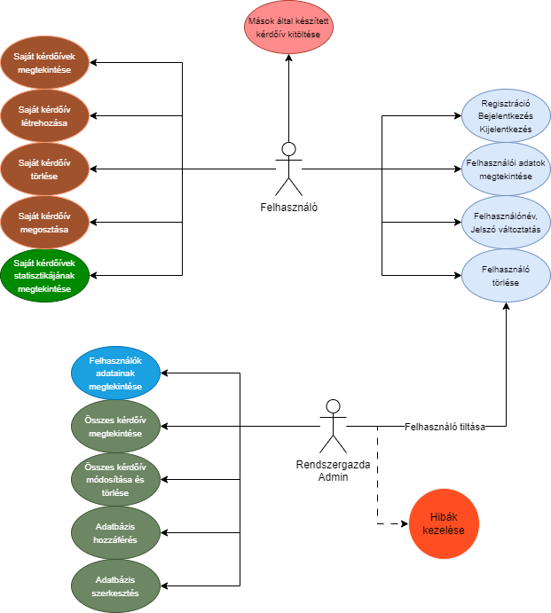

# Rendszer célja

# Projekt terv

# Üzleti folyamatok modellje

Ezen alpont az alkalmazásban zajló kulcsfontosságú üzleti folyamatokat térképezi fel, mint például a regisztráció, bejelentkezés, kérdőív készítés és kitöltés. Ez a részletes leírás segíti a fejlesztőket és érintetteket az alkalmazás üzleti folyamatainak és felhasználói interakcióinak megértésében, azok lépéseinek és szereplőinek jól strukturált bemutatásával.

### Az alábbi ábrán a projekthez tartozó üzleti folyamatok modellje tekinthető meg:

# Követelmények

## Funkcionális követelmények:
- Felhasználó létrehozása 
- Felhasználó tárolása
- Felhasználó adatainak módosítása
- Kérdőív létrehozása
- Kérdőív tárolása
- Kérdőív módosítása
- Kérdőív törlése
- Kérdőívre adott válaszok tárolása
- Kérdőívre adott válaszok kiértékelése
- Webes eszközön működés.
- Felhasználóbarát felület.

## Nem funkcionális követelmények:

## Törvényi előírások, szabványok:

# Funkcionális terv
A felhasználónak:

- Tudnia kell bejelentkezni
- Kérdőívet kell tudnia összellítani
- Kérdőívet kell tudnia módosítani
- Kérdőívet kell tudnia elindítani
- Kérdőívet kell tudnia kiértékelni
- Kérdőívet kell tudnia törölni

A web alkalmazásnak:

- Böngészőből elérhetőnek kell lennie
- Html, Css, JavaScript, React Js frontend, Python backend, JSON fájlok az adatok tárolására
- Az egyes részeknek megfelelően kell kommunikálni egymással

# Architektúrális terv

Egy olyan webalkalmazás, amely Python-Flask backendet és egy ReactJs frontendet használ. A ReactJs magába foglalja a HTML, CSS, Javascript technológiákat is, illetve magát a React keretrendszert is. A frontend a fetch API-t használja a backend API-val való kommunikációhoz. Az adatábzishoz MySql adatbázist választottunk.

# Implementációs terv
### Frontend (HTML, CSS, JavaScript, ReactJS):

Létrehozni komponenseket a felhasználói felület különböző részeihez, például a bejelentkezéshez, regisztrációhoz, kérdőívek listázásához, kérdőív kitöltéséhez és statisztikák megjelenítéséhez.

Implementálni formokat a felhasználók regisztrációjához, bejelentkezéséhez és kérdőívek létrehozásához.

Kérni kell HTTP kéréseket a backend szerver felé a szükséges adatok lekérdezéséhez és a műveletek végrehajtásához.

Kezelni kell az állapotokat és az eseményeket a React állapotkezelési és eseménykezelési mechanizmusain keresztül.

Implementálni felhasználói értesítéseket és hibaüzeneteket a felhasználóbarát felhasználói élmény érdekében a login felületen akár.

### Backend (Flask, Python):

Egy Flask alkalmazást a projekt gyökérmappájába létrehozni.

Definiálni útvonalakat (endpoints) a Flask alkalmazásban a frontend és backend kommunikációhoz, például a regisztrációhoz, bejelentkezéshez, kérdőívek létrehozásához, adatok lekérdezéséhez.

Konfigurálni az adatbázist.

Implementálni felhasználói autentikációt.

Elkészíteni a kérdőívek és válaszok modelljét az adatbázisban(blokkokat).

Kezelni a HTTP kéréseket a frontendtől, ellenőrizd őket és hajtsd végre a megfelelő adatbázisműveleteket.

### Adatbázis (MySQL):

Létrehozni egy MySQL adatbázist a szükséges táblákkal, például a felhasználók, kérdőívek és válaszok táblájával.

Definiálni egyedülálló kulcsokat és indexeket az adatbázis teljesítményének optimalizálása érdekében.

# Fizikai környezet
Az alkalmazás web platformra készül, böngészőből érhető el. A projekthez tartozik mobil nézet, így mobilról is ugyan úgy használható.

### Fejlesztői eszközök
**Integrált fejlesztői környezet**
- [Visual Studio Code](https://code.visualstudio.com/)
- [Visual Studio 2022](https://visualstudio.microsoft.com/vs/)

**Kommunikációs platform**
- [Discord](https://discord.com/)

**Grafikai eszközök**
- [Adobe Photoshop CC 2019](https://www.adobe.com/products/photoshop.html)
- Microsoft Paint

### Fejlesztői eszközök

# Architekturális terv

# Adatbázisterv, adattárolás

# Implementációs terv

# Tesztterv

# Telepítési terv

# Karbantartási terv