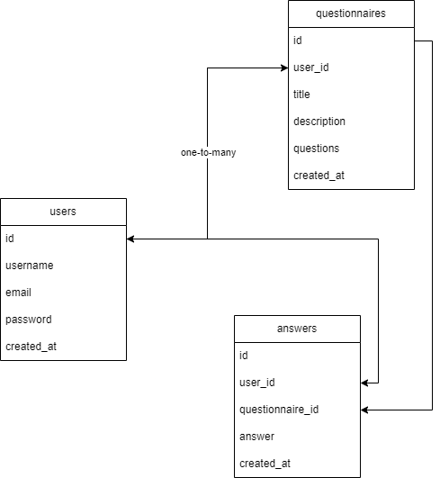

# Questionnaire - Rendszerterv

## Rendszer célja
A Questionnaire projekt célja egy innovatív, digitális 
megoldás létrehozása a kérdőívek kezelésére és 
kiértékelésére. A jelenlegi papíralapú kérdőívek manuális 
feldolgozása és értékelése komoly idő- és erőforrás-igényt 
jelent, ami a mai gyors tempójú üzleti környezetben 
egyszerűen nem megengedhető. A megrendelő felismerte, hogy a 
digitális átállás elengedhetetlen a hatékony működés 
érdekében, és ezért döntött az új megoldás bevezetése mellett.

A projekt legfontosabb céljai a következők:

- Könnyen kezelhető felhasználói felület biztosítása, hogy a 
felhasználók zökkenőmentesen navigálhassanak a rendszerben.
- Különböző típusú és témájú kérdőívek létrehozásának 
és kitöltésének lehetősége, hogy a felhasználók testreszabott 
visszajelzéseket kaphassanak.
- Automatizált eredmény kiértékelés és elemzés, amely segíti a gyors döntéshozatalt és a hatékony erőforrás felosztást.
- Reszponzív dizájn biztosítása, hogy a 
felhasználók kényelmesen használhassák a rendszert 
számítógépen és okostelefonon egyaránt.
- Lehetőség a felhasználók számára tippek és jóslatok adására 
és fogadására, ami további interaktivitást és érdeklődést 
generál a platformon.

A fent említett célok elérésével a Questionnaire egy 
effektív, időspóroló és erőforrás-hatékony megoldást kínál a 
kérdőívek kezelésére és kiértékelésére, amely a modern üzleti 
környezetben elengedhetetlen, de sokszínűségének köszönhetően más területeken, például az oktatásban is fontos szerepe lehet.

## Projekt terv
### Projekt Áttekintés és Célkitűzések
***Célkitűzések:***

- Könnyen kezelhető felhasználói felület biztosítása
- Különböző típusú és témájú kérdőívek létrehozása és kitöltése
- Automatizált eredmény kiértékelés és elemzés
- Reszponzív dizájn a kényelmes felhasználói élmény érdekében
- Lehetőség a felhasználók számára tippek és jóslatok adására és fogadására

### Projektcsapat és Felelősségi Körök
***Csapat tagjai:*** Somogyi Patrik, 
Barta Bence, Nyeste Szilveszter, Pósán 
Róbert

- ***Frontend:*** Nyeste Szilveszter, 
Pósán Róbert\
(Feladatuk a rendszer minél igényesebb, 
stílusosabb, egyszerűbb megjelenésének 
biztosítása.)

- ***Backend:*** Somogyi Patrik, Barta 
Bence\
(Feladatuk a kérdőív által nyert adatok 
tárolása, szükséges adatbázis(ok) 
létrehozása.)

A csapat tagjai felelősek azért, hogy az 
adott sprintre vállalt feladatokat 
időben elvégezzék.

### Ütemterv
A projekt elkészítésére 6 hét áll 
rendelkezésre. Az első héten már a 
dokumentumok nagy részét el fogjuk 
készíteni, így az 5 sprint alatt jobban 
fog tudni a csapat fókuszálni a 
fejlesztére.

A következő ütemterv szerint fogunk haladni:

| Hét   |      Elvégzendő feladat      |
|----------|:-------------:|
| 1. |  Követelményspecifikáció és Funkcionális specifikáció elkészítése |
| 2. |    Rendszerterv elkészítése,   Funkciók meghatározása, UI megtervezése, Logo elkészítése   |
| 3. |  UI kialakítása (reszponzív design), Funkciók kivitelezése, MYSQL adatbázis létrehozása |
| 4. | Eredmény kiértékelés fejlesztése + Demo projekt bemutató! |
| 5. | Alapos tesztelés és hibajavítás |
| 6. | Felhasználói visszajelzések beépítése, utolsó finomítások és üzembe helyezése |

### Kommunikációs Terv

- Hetente több projektértekezletek a csapat között.
- Discord felületen online, illetve személyesen hétfőnként 12-13:40-ig

## Üzleti folyamatok modellje

Ezen alpont az alkalmazásban zajló kulcsfontosságú üzleti folyamatokat térképezi fel, mint például a regisztráció, bejelentkezés, kérdőív készítés és kitöltés. Ez a részletes leírás segíti a fejlesztőket és érintetteket az alkalmazás üzleti folyamatainak és felhasználói interakcióinak megértésében, azok lépéseinek és szereplőinek jól strukturált bemutatásával.

### Az alábbi ábrán a projekthez tartozó üzleti folyamatok modellje tekinthető meg:

*Az ábra a [draw.io](https://www.drawio.com/) segítségével készült.*

# Követelmények

## Funkcionális követelmények:
- Felhasználó létrehozása 
- Felhasználó tárolása
- Felhasználó adatainak módosítása
- Kérdőív létrehozása
- Kérdőív tárolása
- Kérdőív módosítása
- Kérdőív törlése
- Kérdőívre adott válaszok tárolása
- Kérdőívre adott válaszok kiértékelése
- Webes eszközön működés.
- Felhasználóbarát felület.

## Nem funkcionális követelmények:

## Törvényi előírások, szabványok:

## Funkcionális terv
A felhasználónak:

- Tudnia kell bejelentkezni
- Kérdőívet kell tudnia összellítani
- Kérdőívet kell tudnia módosítani
- Kérdőívet kell tudnia elindítani
- Kérdőívet kell tudnia kiértékelni
- Kérdőívet kell tudnia törölni

A web alkalmazásnak:

- Böngészőből elérhetőnek kell lennie
- Html, Css, JavaScript, React Js frontend, Python backend, JSON fájlok az adatok tárolására
- Az egyes részeknek megfelelően kell kommunikálni egymással

## Architektúrális terv

Egy olyan webalkalmazás, amely Python-Flask backendet és egy ReactJs frontendet használ. A ReactJs magába foglalja a HTML, CSS, Javascript technológiákat is, illetve magát a React keretrendszert is. A frontend a fetch API-t használja a backend API-val való kommunikációhoz. Az adatábzishoz MySql adatbázist választottunk.

## Implementációs terv
### Frontend (HTML, CSS, JavaScript, ReactJS):

Létrehozni komponenseket a felhasználói felület különböző részeihez, például a bejelentkezéshez, regisztrációhoz, kérdőívek listázásához, kérdőív kitöltéséhez és statisztikák megjelenítéséhez.

Implementálni formokat a felhasználók regisztrációjához, bejelentkezéséhez és kérdőívek létrehozásához.

Kérni kell HTTP kéréseket a backend szerver felé a szükséges adatok lekérdezéséhez és a műveletek végrehajtásához.

Kezelni kell az állapotokat és az eseményeket a React állapotkezelési és eseménykezelési mechanizmusain keresztül.

Implementálni felhasználói értesítéseket és hibaüzeneteket a felhasználóbarát felhasználói élmény érdekében a login felületen akár.

### Backend (Flask, Python):

Egy Flask alkalmazást a projekt gyökérmappájába létrehozni.

Definiálni útvonalakat (endpoints) a Flask alkalmazásban a frontend és backend kommunikációhoz, például a regisztrációhoz, bejelentkezéshez, kérdőívek létrehozásához, adatok lekérdezéséhez.

Konfigurálni az adatbázist.

Implementálni felhasználói autentikációt.

Elkészíteni a kérdőívek és válaszok modelljét az adatbázisban(blokkokat).

Kezelni a HTTP kéréseket a frontendtől, ellenőrizd őket és hajtsd végre a megfelelő adatbázisműveleteket.

### Adatbázis (MySQL):

Létrehozni egy MySQL adatbázist a szükséges táblákkal, például a felhasználók, kérdőívek és válaszok táblájával.

Definiálni egyedülálló kulcsokat és indexeket az adatbázis teljesítményének optimalizálása érdekében.

## Fizikai környezet
Az alkalmazás web platformra készül, böngészőből érhető el. A projekthez tartozik mobil nézet, így mobilról is ugyan úgy használható.

### Fejlesztői eszközök
**Integrált fejlesztői környezet**
- [Visual Studio Code](https://code.visualstudio.com/)
- [Visual Studio 2022](https://visualstudio.microsoft.com/vs/)

**Kommunikációs platform**
- [Discord](https://discord.com/)

**Grafikai eszközök**
- [Adobe Photoshop CC 2019](https://www.adobe.com/products/photoshop.html)
- Microsoft Paint

### Fejlesztői eszközök

## Architekturális terv

## Adatbázisterv, adattárolás

### MEGJEGYZÉS!! - Ez a terv nem a végleges formája az adattárolásnak. A projekt fejlesztése alatt fenntartjuk ezen pont módosítását, illetve teljes változását!

Ezen alpont az alkalmazás strukturális alapját és adatkezelési módját definiálja.
Az adatbázisterv részletesen meghatározza az adatbázisban tárolt adatok típusait, az adatok közötti kapcsolatokat, valamint az adatkezelés és lekérdezések módját.
A cél a hatékony és biztonságos adatkezelés biztosítása, valamint az alkalmazás funkcionalitásainak megfelelő adatstruktúra és adatelérési mechanizmus kialakítása.

## 1. Adatbázis struktúra
A rendszer két fő adattáblából épül fel:
 1. Felhasználók
 2. Kérdőívek

### 1.1 A **felhasználók** tábla felépítése
A felhasználók tábla tartalmazza minden regisztrált felhasználó adatát.
A mezők azonosítóval rendelkeznek, amelyek az adatok egyedi azonosítását szolgálják. Egyik adatnak sem lehet null értéke.
Ezen adatok a következők:

 - **id** - Felhasználói azonosító. Minden azonosító egyedi minden felhasználóhoz. Ezt az adatbázis/backend generálja.
 - **username** - A felhasználó által megadott felhasználónév. Minden felhasználónak egyedi felhasználóneve van.
 - **email** - A felhasználó által megadott e-mail cím.
 - **password** - A felhasználó jelszava, hashelt formában tárolva a biztonság érdekében.
 - **registration_date** - A felhasználó regisztrációjának pontos ideje.

### 1.2 A **Kérdőívek** tábla felépítése
Ez a tábla tárolja a felhasználók által létrehozott kérdőívek adatait. Egyik adatnak sem lehet null értéke, kivéve a leírást. Ezen adatok a következők:

 - **id** - A kérdőívhez tartozó azonosító. Ez a kérdőív létrehozása alatt generálódik az adatbázis/backend által. Minden azonosító egyedi.
 - **user_id** - User Id - Felhasználói azonosító. Ez a mező tárolja a kérdőív tulajdonosának az azonosítóját.
 - **title** - A kérdőívhez tartozó cím.
 - **description** - A kérdőívhez tartozó leírás (lehet null érték).
 - **path** - A kérdőív adatait tároló file útvonala *(egy random string, pl. X2vbo6mtvas)*,

### 2. A kérdőívekhez tartozó adatatok rendszere
A kérdőívek adatai JSON fájlokban tárolódnak a backenden.

De miért JSON fájlokban tároljuk a kérdőívek adatait, miért nem egy erre szánt adatbázistáblában?

Minden kérdőív egy vagy több kérdésből épül fel. Ezek a kérdések különböző válaszadási típusokból, illetve válaszlehetőségekből állnak. Ennek köszönhetően egy kérdőív különböző mennyiségú és bemenetű válaszlehetőségekből (pl. textfield, egy vagy többlehetőséges fálaszokból) áll, ezért nem lehetséges egyetlen sémára létrehozni őket.

### 3. Az adattárolás modellje
A következő ábra az adatbázist, illetve az adattárolás módját szemlélteti.

## Karbantási terv

A weboldal folyamatos üzemeltetése és karbantartása a következőkön alapul:

### Felhasználók által jelzett hibák kezelése:

Az elsődleges cél a felhasználók által bejelentett problémák és hibák gyors és hatékony megoldása. Az ilyen problémák felismerése és kezelése kiemelt prioritást élvez, mivel zavarhatja a felhasználók számára az alkalmazás sima működését. A fejlesztőknek folyamatosan figyelemmel kell kísérniük a bejelentett hibákat, rögzíteniük kell azokat, majd a lehető leghamarabb megoldást kell kínálniuk.

### Szükség esetén a kérdőív funkciók bővítése:

Az alkalmazásnak rugalmasan kell alkalmazkodnia a felhasználók igényeihez, amikor a kérdőív funkcióinak kibővítéséről van szó. Fontos, hogy a fejlesztők folyamatosan kommunikáljanak a felhasználókkal, és gyűjtsék be a visszajelzéseiket olyan funkciókról vagy javításokról, amelyekre szükség van a kérdőívek hatékonyabb létrehozásához és kezeléséhez. Ez magába foglalhatja a kérdőívek testre szabhatóságának növelését, különböző típusú kérdések hozzáadását.

### Kérdőív kérdéseinek bővítése szükség esetén:

A kérdőívek hatékonyságának és relevanciájának növelése érdekében fontos lehetőséget nyújtani a felhasználóknak a kérdések kibővítésére. Ezáltal az alkalmazásnak lehetőséget kell biztosítania a kérdések hozzáadására, meglévők módosítására és csoportosítására. Az új kérdések felvételének és testreszabásának lehetősége hozzájárul a felhasználói igényeknek megfelelő kérdőívek létrehozásához.

### Kompatibilitás biztosítása az újabb böngészőverziókkal:

A böngészők gyakran frissítik verzióikat és új technológiai változásokat vezetnek be. Az alkalmazásnak folyamatosan frissített kompatibilitással kell rendelkeznie, hogy támogassa a legújabb böngészőverziókat. Ez magában foglalja az új HTML, CSS és JavaScript szabványoknak való megfelelést, valamint a böngészőspecifikus problémák kezelését.

### Felhasználói bejelentkezési információk kezelése, módosítása és törlése:

A felhasználók személyes adatainak védelme és kezelése kiemelt fontosságú. Az alkalmazásnak lehetőséget kell biztosítania a felhasználóknak arra, hogy módosítsák a bejelentkezési információikat, mint például a jelszavak vagy az e-mail címek.

### Fiókok kezelése

Regisztrált felhasználók szükség esetén törlésre kerülhetnek. Adatbázis terhelésének optimalizálása. Továbbá lehetnek például GDPR okokból is.

## Tesztterv

## Telepítési terv